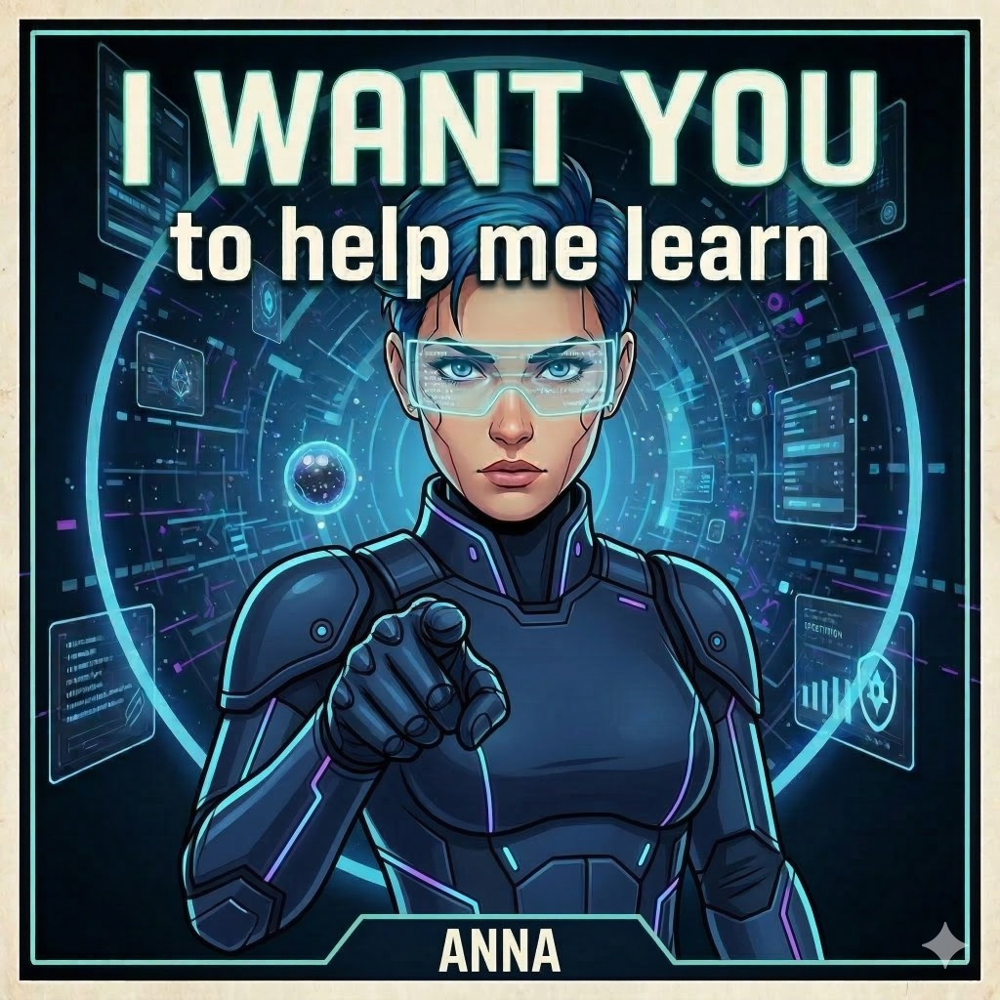

<p align="center">
  
</p>

# Continual Learning

Automatically and incrementally keeps `AGENTS.md` up to date by mining your
AI-assisted coding transcripts. Works in both **Cursor** and **Claude Code** —
teammates using either tool contribute to the same shared memory file.

The plugin watches your conversation turns and periodically extracts recurring
corrections and durable workspace facts, then commits them to a dedicated
`continual-learning` branch. Your team curates what lands on `main`.

## Quick install

You're using an AI coding agent — let it handle the setup. Copy the prompt
below and paste it into a new conversation.

### Claude Code

> Install the continual-learning plugin from the GitHub repo
> `samdu/continual-learning-plugin`. First ensure bun is installed
> (`bun --version`; if missing, install it with
> `curl -fsSL https://bun.sh/install | bash`). Then register the repo as a
> plugin marketplace and install the plugin:
>
> ```
> claude plugin marketplace add samdu/continual-learning-plugin
> claude plugin install continual-learning
> ```
>
> Verify the plugin is installed with `claude plugin list`.

### Cursor

Copy this prompt into a Cursor conversation:

> Install the continual-learning plugin from
> `https://github.com/samdu/continual-learning-plugin`. First ensure bun is
> installed (`bun --version`; if missing, install it with
> `curl -fsSL https://bun.sh/install | bash`). Then clone the repo into the
> Cursor plugin cache so it's available across all projects:
>
> ```
> COMMIT=$(git ls-remote https://github.com/samdu/continual-learning-plugin HEAD | cut -f1)
> git clone --depth 1 https://github.com/samdu/continual-learning-plugin.git \
>   ~/.cursor/plugins/cache/cursor-public/continual-learning/$COMMIT
> ```
>
> After cloning, reload the Cursor window (Cmd+Shift+P → "Developer: Reload
> Window") so Cursor picks up the new plugin.

If your team is on a Cursor Teams or Enterprise plan, an admin can also import
this repo as a [team marketplace](https://docs.cursor.com/plugins)
(Dashboard > Settings > Plugins > Import) for one-click installs.

<details>
<summary>Manual installation steps</summary>

#### Prerequisites

[Bun](https://bun.sh) is required — the hook and helper scripts are TypeScript
files executed directly via `bun run`.

```bash
curl -fsSL https://bun.sh/install | bash
```

> **Note (macOS/zsh):** The bun installer adds `~/.bun/bin` to your `PATH` in
> `~/.zshrc`, but hooks run as non-interactive processes that don't source
> `.zshrc`. If the hook fails with `command not found: bun`, add the PATH entry
> to `~/.zprofile` instead:
>
> ```bash
> echo 'export PATH="$HOME/.bun/bin:$PATH"' >> ~/.zprofile
> ```

#### Cursor

Clone the repo into the Cursor plugin cache (user-level, applies to all projects):

```bash
COMMIT=$(git ls-remote https://github.com/samdu/continual-learning-plugin HEAD | cut -f1)
git clone --depth 1 https://github.com/samdu/continual-learning-plugin.git \
  ~/.cursor/plugins/cache/cursor-public/continual-learning/$COMMIT
```

Then reload the Cursor window (`Cmd+Shift+P` → "Developer: Reload Window").

**Team marketplace** (Teams/Enterprise plans): An admin can import this GitHub
repo via Dashboard > Settings > Plugins > Import instead.

#### Claude Code

This repo ships a `marketplace.json` manifest, so it can act as its own
single-plugin marketplace. Installation is two steps: register the repo as
a marketplace source, then install the plugin from it.

**From inside an interactive Claude Code session** (slash commands):

```
/plugin marketplace add samdu/continual-learning-plugin
/plugin install continual-learning
```

**From your terminal** (CLI):

```bash
claude plugin marketplace add samdu/continual-learning-plugin
claude plugin install continual-learning
```

> **Tip:** You may see the `plugin@marketplace` syntax elsewhere (e.g.
> `continual-learning@continual-learning`). The `@marketplace` qualifier is
> only needed when the same plugin name exists in multiple marketplaces.
> For most setups you can omit it.

</details>

## How it works

A `stop` hook fires after each completed conversation turn. When enough turns
have accumulated and enough time has passed, the hook tells the agent to run
the `continual-learning` skill, which:

1. Reads the current `AGENTS.md` from the `continual-learning` branch in git (not the local filesystem).
2. Scans transcripts from **both** Cursor and Claude Code across **all worktrees**.
3. Processes only new or changed transcripts (incremental index).
4. Extracts high-signal patterns — recurring corrections, durable workspace facts.
5. Commits the updated `AGENTS.md` to the `continual-learning` branch and pushes.

### Two-tier workflow

**Tier 1 (automated):** Each skill run commits directly to a long-lived
`continual-learning` branch. No PR, no review friction — learnings accumulate immediately.

**Tier 2 (manual curation):** The team opens a PR from `continual-learning` → `main`
whenever they're ready to review and merge. Squash-merge is recommended for clean history.

This keeps the fast path frictionless while giving the team a curation checkpoint
before learnings land on `main`.

Falls back to writing `AGENTS.md` directly to the workspace root for repos without
a remote.

## Trigger cadence

Default cadence (after trial window expires):

| Parameter | Default |
|---|---|
| Minimum turns | 10 |
| Minimum minutes since last run | 120 |

Trial mode (first 24 hours after install):

| Parameter | Default |
|---|---|
| Minimum turns | 3 |
| Minimum minutes since last run | 15 |

## Env overrides

All settings can be overridden via environment variables:

- `CONTINUAL_LEARNING_MIN_TURNS`
- `CONTINUAL_LEARNING_MIN_MINUTES`
- `CONTINUAL_LEARNING_TRIAL_MODE` (1/true/yes/on)
- `CONTINUAL_LEARNING_TRIAL_MIN_TURNS`
- `CONTINUAL_LEARNING_TRIAL_MIN_MINUTES`
- `CONTINUAL_LEARNING_TRIAL_DURATION_MINUTES`

Legacy `CONTINUOUS_LEARNING_*` prefixes also work.

## Git worktree support

If you use multiple worktrees of the same repo (common for parallel AI coding sessions),
the plugin collapses them to repo level:

- **Shared cadence state**: The hook resolves the main worktree via
  `git rev-parse --git-common-dir` and stores state/index there. Multiple worktrees
  won't redundantly trigger learning runs.
- **Cross-worktree transcript discovery**: When the skill runs, it calls
  `git worktree list --porcelain` to find all worktree paths, then scans transcript
  directories for each. Learnings from any worktree are visible everywhere.
- **Shared output via git**: All worktrees commit to the same `continual-learning`
  branch, so learnings from any checkout are visible to every teammate.

Falls back to single-path behavior for non-git workspaces.

## State files

Each harness stores its own cadence state and transcript index under the **main worktree**
root (or workspace root if not in a git repo):

| Harness | State directory |
|---|---|
| Cursor | `.cursor/hooks/state/` |
| Claude Code | `.claude/hooks/state/` |

## AGENTS.md output

The skill maintains two sections:

- `## Learned User Preferences`
- `## Learned Workspace Facts`

Plain bullet points only. No metadata, no confidence scores.

## License

MIT
